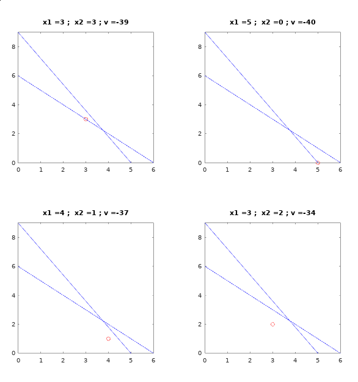

# branch-and-bound
Branch and Bound algorithm implemented as project for optimization course (EA044).  

## Usage
You can either run `octave main.m` and enter the inputs asked, or run `octave main.m < <file>` where `<file` is the file containing the inputs in the specified format. You can also run in the gui interface of octave.  
Exemple file archive:
``` matlab
  [-2; -1]    % coefficients of the function to be minimized
  [2 1; 1 1]  % matrix of coefficients of the LHS of the constraints
  [50; 25]    % RHS of the contraints, one per line

```

## Dependencies
The only dependency is the package optim used for solving linear programming problems.

## Example
`octave main.m < tests/test2.m`
```
Enter the coefficients of the function to minimize in the form of a column vector:
f =

  -8
  -5

Enter the coefficients of the left hand side of the constraints in the form of an array with one constraint per line:
A =

   1   1
   9   5

Enter the right hand side of the constraints in the form of a column vector:
B =

    6
   45

Variables values:
   5
   0
Iterations:  5
Value of the optimal solution: -40
```

