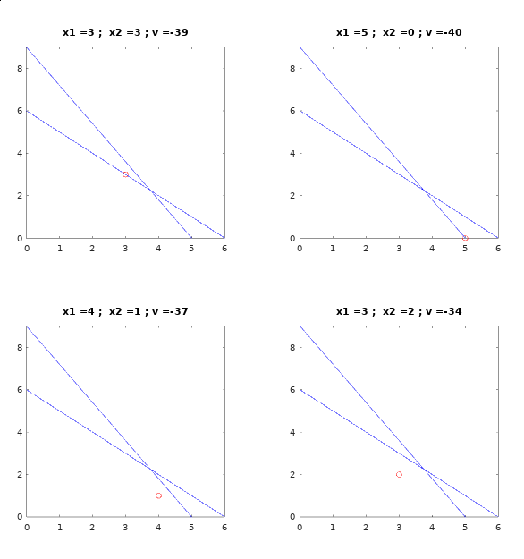

# PC2 - EA044
Nome: Rafael Gonçalves RA: 186062  
Algoritimo branch and bound utilizando octave e o pacote optim (que possui a função linprog para resolver problemas de programação linear).

## Modo de usar

É possível utilizar o algoritimo rodando o arquivo `main.m` através da linha de comando ou pela interface gráfica do octave e dar as entradas como pedido pelo programa. Alternativamente é possível colocar as entradas em um arquivo de texto e executar o comando `octave main.m < <file>` onde `<file>` é o arquivo com as entradas.
Exemplo do arquivo de texto com as entradas:
``` matlab
  [-2; -1]    % coefficients of the function to be minimized
  [2 1; 1 1]  % matrix of coefficients of the LHS of the constraints
  [50; 25]    % RHS of the contraints, one per line

```

## Exemplo
`octave main.m < tests/test2.m`
```
Enter the coefficients of the function to minimize in the form of a column vector:
f =

  -8
  -5

Enter the coefficients of the left hand side of the constraints in the form of an\
array with one constraint per line:
A =

   1   1
   9   5

Enter the right hand side of the constraints in the form of a column vector:
B =

    6
   45

Variables values:
   5
   0
Iterations:  5
Value of the optimal solution: -40
```

